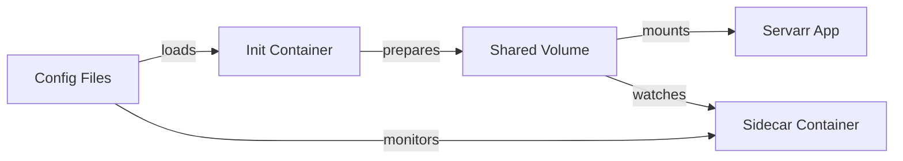

# PrepArr

[](https://github.com/robbeverhelst/Preparr/actions/workflows/ci.yml)
[](https://github.com/robbeverhelst/Preparr/releases/latest)
[](https://renovatebot.com/)
[](https://opensource.org/licenses/MIT)

> Automate the setup and configuration of Sonarr, Radarr, Prowlarr, Bazarr, and qBittorrent — from empty PostgreSQL databases to fully working, connected services.

PrepArr is a Docker sidecar that manages your entire media stack as code. It handles database creation, config file generation, API key setup, download clients, indexers, quality profiles, and subtitle providers — all from JSON files. No setup wizards, no manual clicking, no config drift.

### Supported Services

| Service | Status | What it does |
|---------|--------|--------------|
| **Sonarr** | ✅ Fully supported | TV show management |
| **Radarr** | ✅ Fully supported | Movie management |
| **Prowlarr** | ✅ Fully supported | Indexer management + sync to Sonarr/Radarr |
| **Bazarr** | ✅ Fully supported | Subtitle management for Sonarr/Radarr |
| **qBittorrent** | ✅ Config management | Download client configuration |

**⚠️ Requires PostgreSQL** (SQLite not supported)

## 🏗️ Architecture

PrepArr uses a **three-container pattern** for each Servarr application:



1. **Init Container** - Runs once, sets up databases and config files, then exits
2. **Servarr/Bazarr App** - Standard Linuxserver container using prepared config
3. **Sidecar Container** - Continuously applies your JSON configuration

## 🚀 Quick Start

### Complete Sonarr Stack
```yaml
version: '3.8'
services:
  postgres:
    image: postgres:16-alpine
    environment:
      POSTGRES_USER: postgres
      POSTGRES_PASSWORD: postgres123
      POSTGRES_DB: servarr

  # 1. Init Container - Setup databases and config.xml
  sonarr-init:
    image: ghcr.io/robbeverhelst/preparr:latest
    command: ["bun", "run", "dist/index.js", "--init"]
    environment:
      POSTGRES_HOST: postgres
      POSTGRES_PASSWORD: postgres123
      SERVARR_URL: http://sonarr:8989
      SERVARR_TYPE: sonarr
      SERVARR_ADMIN_PASSWORD: adminpass
      CONFIG_PATH: /config/sonarr-config.json
    volumes:
      - sonarr_config:/config
      - ./sonarr-config.json:/config/sonarr-config.json:ro
    depends_on: [postgres]

  # 2. Servarr App - Standard container
  sonarr:
    image: linuxserver/sonarr:latest
    ports: ["8989:8989"]
    volumes:
      - sonarr_config:/config
      - ./tv:/tv
      - ./downloads:/downloads
    depends_on:
      sonarr-init:
        condition: service_completed_successfully

  # 3. Sidecar - Continuous configuration management
  sonarr-sidecar:
    image: ghcr.io/robbeverhelst/preparr:latest
    environment:
      POSTGRES_HOST: postgres
      POSTGRES_PASSWORD: postgres123
      SERVARR_URL: http://sonarr:8989
      SERVARR_TYPE: sonarr
      SERVARR_ADMIN_PASSWORD: adminpass
      CONFIG_PATH: /config/sonarr-config.json
      CONFIG_WATCH: "true"
      HEALTH_PORT: 9001
    ports: ["9001:9001"]
    volumes:
      - sonarr_config:/config
      - ./sonarr-config.json:/config/sonarr-config.json:ro
    depends_on: [sonarr]

volumes:
  sonarr_config:
```

### Configuration File (`sonarr-config.json`)
Define your entire Servarr setup as code:

```json
{
  "apiKey": "2bac5d00dca43258313c734821a15c4c",
  "prowlarrSync": true,
  "rootFolders": [
    {
      "path": "/tv",
      "accessible": true
    }
  ],
  "qualityProfiles": [
    {
      "name": "HD - 1080p",
      "cutoff": 1080,
      "items": [
        {
          "quality": { "id": 1, "name": "HDTV-1080p" },
          "allowed": true
        },
        {
          "quality": { "id": 2, "name": "WEBDL-1080p" },
          "allowed": true
        }
      ]
    }
  ],
  "downloadClients": [
    {
      "name": "qBittorrent",
      "implementation": "QBittorrent",
      "implementationName": "qBittorrent",
      "configContract": "QBittorrentSettings",
      "fields": [
        { "name": "host", "value": "qbittorrent" },
        { "name": "port", "value": 8080 },
        { "name": "username", "value": "admin" },
        { "name": "password", "value": "adminpass" },
        { "name": "category", "value": "tv" }
      ],
      "enable": true,
      "priority": 1
    }
  ]
}
```

#### Configuration Options

**`prowlarrSync`** - Set to `true` to allow Prowlarr to manage indexers automatically via application sync. When enabled, the sidecar skips indexer management to prevent conflicts with Prowlarr's indexer synchronization.

- `true` - Prowlarr manages indexers (recommended for multi-service setups)
- `false` - Sidecar manages indexers directly via config file (default)

## 🎯 Multi-Service Setup

For complete Prowlarr + Sonarr + Radarr + Bazarr stack, see our [docker-compose.test.yml](docker-compose.test.yml) which includes:

- **Prowlarr** managing indexers and syncing to Sonarr/Radarr
- **Sonarr** for TV shows with automatic download client setup
- **Radarr** for movies with shared qBittorrent client
- **Bazarr** for subtitles, linked to Sonarr and Radarr
- **qBittorrent** configured automatically by PrepArr
- **Shared PostgreSQL** database for all services

Each service gets its own init + sidecar containers managing separate config files.

## 🔧 How It Works

### Init Mode (`--init`)
1. **Database Setup**: Creates PostgreSQL databases and users
2. **Config Generation**: Creates config.xml with database credentials and API keys
3. **API Key Management**: Generates or uses provided API keys
4. **Initial Configuration**: Applies your JSON config for first boot
5. **Exits**: Lets the main Servarr container start with prepared config

### Sidecar Mode (default)
1. **Waits**: For Servarr application to be ready
2. **Monitors**: JSON configuration files for changes
3. **Reconciles**: Applies configuration via Servarr APIs
4. **Health**: Exposes /health and /ready endpoints
5. **Repeats**: Continuous monitoring and drift correction

## 🌟 Key Benefits

- **Zero Manual Setup** - Fresh deployments boot directly to configured state
- **Configuration as Code** - Version control your entire media stack
- **Truly Stateless** - Eliminates persistent config volumes, Servarr apps become ephemeral
- **Drift Prevention** - Sidecar ensures config stays as specified
- **GitOps Ready** - Update configs via git, automatic deployment
- **Multi-Service** - Coordinate complex Prowlarr + Sonarr + Radarr + Bazarr setups

## 📦 Deployment Options

### Helm Chart (Recommended)

```bash
# Install the complete stack
helm install my-media-stack oci://ghcr.io/robbeverhelst/charts/preparr --version <version>

# Or with custom values
helm install my-media-stack oci://ghcr.io/robbeverhelst/charts/preparr --version <version> -f custom-values.yaml
```

Find the chart on [ArtifactHub](https://artifacthub.io/packages/helm/preparr/preparr) or see the [Helm chart documentation](helm/preparr/README.md).

### Docker Compose

See examples above and in [examples/](examples/) directory.

### Kubernetes

Use the Helm chart or manual manifests with init containers + sidecars + ConfigMaps.

## 🛡️ Production Ready

- **Health Checks** - `/health` and `/ready` endpoints for orchestrators
- **Observability** - Structured JSON logging with correlation IDs  
- **Configuration Validation** - Zod schema validation prevents bad configs
- **Error Recovery** - Automatic retry with exponential backoff
- **Signal Handling** - Graceful shutdown on SIGTERM/SIGINT
- **Security** - Runs as non-root, secrets via environment variables

## 📖 Documentation

Full documentation is available at **[robbeverhelst.github.io/Preparr](https://robbeverhelst.github.io/Preparr)**.

- **[Quick Start](https://robbeverhelst.github.io/Preparr/getting-started/quick-start/)** - Get up and running
- **[Deployment Guides](https://robbeverhelst.github.io/Preparr/deployment/docker-compose/)** - Docker Compose, Kubernetes, Helm
- **[Configuration Reference](https://robbeverhelst.github.io/Preparr/configuration/overview/)** - All configuration options
- **[Troubleshooting](https://robbeverhelst.github.io/Preparr/troubleshooting/)** - Common issues and solutions

## 🤝 Contributing

We welcome contributions! Please see our [Contributing Guide](CONTRIBUTING.md) for development setup and guidelines.

## 📝 License

MIT License - see [LICENSE](LICENSE) file for details.

---

**Infrastructure as Code for Servarr** • [Examples →](examples/) • [GitHub Packages →](https://github.com/robbeverhelst/preparr/pkgs/container/preparr)